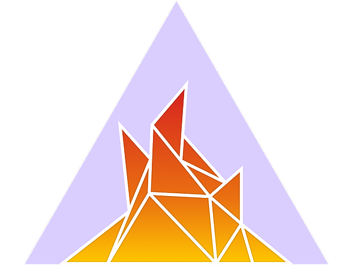

# Learn to Code with Us!

## Beginner Coding Workshop

Beginners with no web development experience will have the chance to give coding a try with in-person help from coaches at this workshop! It will be at [Clevyr](https://clevyr.com/) on Saturday, October 22, 2022. The deadline to [apply to attend](https://forms.gle/zwhcyCNG3WXxtbYo6) this workshop is October 8.

We'll start at 1:00 pm and go until 5:00 pm. This event is free to attendees because of our sponsors!

### Sponsors

We’re looking for [sponsors](https://docs.google.com/document/d/1l3QvZ0DInVqpiKFsdw4L3ZinT-J4m_wL6JDDRx0uv44/) to cover the costs for this beginner-level coding workshop so that it’s free for community members to attend.

Contact for sponsorship questions and sales, or to request an in-kind or other custom sponsorship package:

```
Kimberly Collins
Workshop Facilitator
kcollins at techlahoma.org
```

#### Thank you to our sponsors!

<div class="sponsor gold-level">
  <a href="https://www.ghost.agency/" target="_blank">
    
  </a>
</div>

<div class="sponsor-group">
  <div class="sponsor">
    <a href="https://www.startup.dev" target="_blank">
      
    </a>
  </div>
  <div class="sponsor">
    <a href="https://sugarsecurity.com/" target="_blank">
      
    </a>
  </div>
  <div class="sponsor">
    <a href="https://www.ofashandfire.com/" target="_blank">
      
      <p>Of Ash and Fire</p>
    </a>
  </div>  
</div>

### Curriculum

We'll be using the [Legacy Responsive Web Design](https://www.freecodecamp.org/learn/responsive-web-design/) course on [freeCodeCamp](https://www.freecodecamp.org/)! Brand-new coders will start at the [Basic HTML](https://www.freecodecamp.org/learn/responsive-web-design/#basic-html-and-html5) section.

If you've worked on this course before, you can start where you left off. Be sure to log in to save your progress! The goal for this workshop is to get as far in this course as possible. If you've already finished this certification, consider coaching or volunteering instead!

### Participants

Our audience for this workshop is adults learning about coding with HTML and CSS. We expect to have 20-30 attendees, 10-12 volunteers (including coaches), and a facilitator. Coaches will be experienced developers. Members of underrepresented groups are highly encouraged to attend!

#### Attendees

- We'll let you know whether your [application to attend](https://forms.gle/zwhcyCNG3WXxtbYo6) is accepted as soon as we can.
- You'll need to bring a laptop to this workshop. If you don't have access to one, you can [borrow a Chromebook](https://www.metrolibrary.org/discover/technology#computers) from the Metropolitan Library System.
- We'll be communicating with participants through [Techlahoma's Slack](https://fccokc.com/slack), so joining it is a requirement for this workshop!
- If you're interested but can't make it to the workshop:
    * Fill out the attendee application but mark that you can't go on the attendance question at the end.
    * If you already signed up, let the workshop facilitator know you won't be there.
    * Look for other coding meetups to attend instead at [Techlahoma's Meetup](https://www.meetup.com/techlahoma-foundation). 
    * Join the community in [Techlahoma's Slack](https://fccokc.com/slack).

#### Coaches and Volunteers

- ~~We'll need some coaches for this workshop! Coaching is pretty low-key and low-stress.~~
- We have enough coaches, but contact us about volunteering in other ways!

#### Facilitator

- Please contact facilitator Kimberly Collins (kcollins at techlahoma.org) if you have any questions about the workshop or are interested in sponsorship or volunteering!
- [Kimberly](https://www.linkedin.com/in/collins-kimberly/) is a professional software development consultant with 16 years of experience and strong ties to the local technology community. She has organized numerous user group meetups and networking events, been involved in coding bootcamps, given talks, and mentored junior developers. She has facilitated workshops on Django, Ruby on Rails, and HTML/CSS and is excited about this one!

## Slack

- [Techlahoma's Slack](https://fccokc.com/slack) is where we'll be communicating before the workshop and sharing information that day. 
- It's also a great place to get to know members of the tech community and find out about local events that are happening. 
- Be sure to periodically check the [#2022-10-22-workshop channel](https://techlahoma.slack.com/archives/C03HTF0S50V) for updates! 
- You may also check out the [#hacktoberfest channel](https://techlahoma.slack.com/archives/CD437A8CS) for updates on how to get started with pull requests. 
- Watch [this video](https://youtu.be/RRxQQxiM7AA) for tips if you're new to Slack!

## HTML and CSS

What are HTML and CSS? Read about them in The Odin Project's [foundations course](https://www.theodinproject.com/lessons/foundations-introduction-to-html-and-css)!

### HTML Resources

- [Codecademy Cheatsheets](https://www.codecademy.com/learn/learn-html/modules/learn-html-elements/cheatsheet)
- [MDN Web Docs](https://developer.mozilla.org/en-US/docs/Web/HTML)
- [W3Schools](https://www.w3schools.com/html/)

### CSS Resources

- [Codecademy Cheatsheets](https://www.codecademy.com/learn/learn-css/modules/syntax-and-selectors/cheatsheet)
- [CSS Tricks](https://css-tricks.com/)
- [MDN Web Docs](https://developer.mozilla.org/en-US/docs/Web/CSS)
- [W3Schools](https://www.w3schools.com/css/)

## Techlahoma

This workshop is hosted by the [Techlahoma Foundation](https://www.techlahoma.org/), a professional network of more than 5,000 information technology workers, hobbyists, students, teachers, and future technologists.

Techlahoma hosts monthly user group meetups and 3 annual conferences (200 OK, UXOK, and ThunderPlains) that train on the latest skills needed to obtain employment and succeed in today's increasingly tech-focused workforce. We teach and discuss topics ranging from design, coding, data science, hardware, mobile apps, and much more.

<a href="https://www.techlahoma.org/"></a>

### Donations

Businesses and individuals can make a single [one-time donation](https://techlahoma.app.neoncrm.com/np/clients/techlahoma/donation.jsp?campaign=8) or set up a [recurring monthly donation](https://techlahoma.z2systems.com/donation.jsp?campaign=19) to Techlahoma to support our ongoing community programs!
